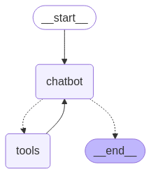

# README 

This code creates a Chaptbot with web search capabilites and memory, following consecutive steps of a [langchain tutorial](https://langchain-ai.github.io/langgraph/tutorials/introduction/#part-3-adding-memory-to-the-chatbot). 

The resulting chatbot will (still) look like this:

However, it will have the capability to remember previous conversations. This is a useful ability for a chatbot per se, but will later also support error recovery and other things.

## Install

* Use the `requirements.txt` to install all necessary libraries. 
* You can get a free API Key from Anthropic [here](https://console.anthropic.com/login). Place it in a file called `anthropic_api_key.txt`.
* You can get a free Tavily API Key for your search engine [here](https://docs.tavily.com/documentation/quickstart). Place it in a file called `tavily_api_key.txt`.

