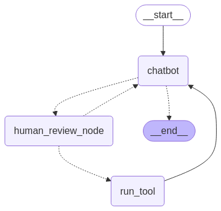

# README 

This code creates a Chaptbot with web search capabilites and memory, following consecutive steps of a [langchain tutorial](https://langchain-ai.github.io/langgraph/tutorials/introduction/#part-4-human-in-the-loop). We will also extend the code following instructions from [this langchain tutorial on human review of tool calls](https://langchain-ai.github.io/langgraph/how-tos/human_in_the_loop/review-tool-calls/#simple-usage).

The resulting chatbot will look like this:

It will have the capability to remember previous conversations and it will be able to ask for human input before a tool is called.

## Install

* Use the `requirements.txt` to install all necessary libraries. 
* You can get a free API Key from Anthropic [here](https://console.anthropic.com/login). Place it in a file called `anthropic_api_key.txt`.
* You can get a free Tavily API Key for your search engine [here](https://docs.tavily.com/documentation/quickstart). Place it in a file called `tavily_api_key.txt`.

