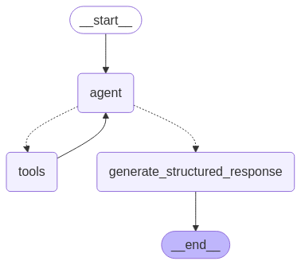

# README 

This code creates a simple graph network using to agents talking to each other, following steps of a [langchain tutorial](https://langchain-ai.github.io/langgraph/how-tos/create-react-agent-structured-output/#code). 

The resulting chatbot will look like this:

It will be able to create output in a pre-defined format.

## Install

* Use the `requirements.txt` to install all necessary libraries. 
* You can get a free API Key from Anthropic [here](https://console.anthropic.com/login). Place it in a file called `anthropic_api_key.txt`.

