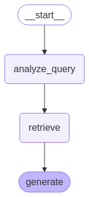

# README 

This code creates a simple Retrieval Augmented Generation architecture, following steps of a [langchain tutorial](https://python.langchain.com/docs/tutorials/rag/#langsmith). 

The resulting chatbot will look like this:

## Install

* Use the `requirements.txt` to install all necessary libraries. 
* You can get a free API Key from Anthropic [here](https://console.anthropic.com/login). Place it in a file called `anthropic_api_key.txt`.
* you can get a free LangSmith API key from LangSmith [here](https://smith.langchain.com/). Place it in a file called `langsmith_api_key.txt`

